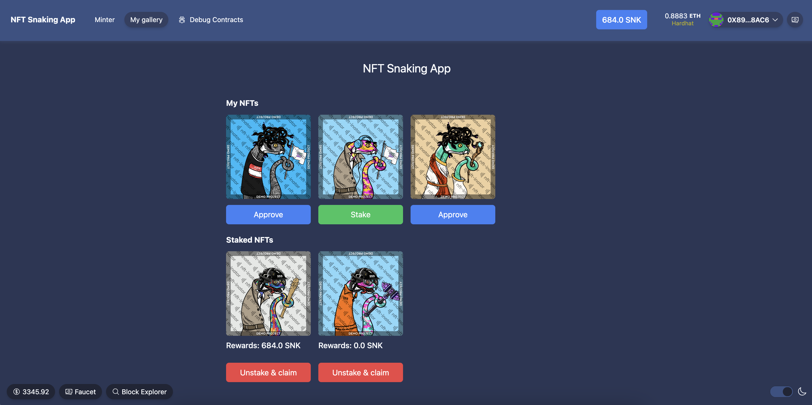

# NFT Snaking 🐍 App on 🏗 Scaffold-ETH 2

## About The Project

<p align="center">
  
</p>

The Snake NFT Minting and Staking App is an innovative platform where users can create, collect, and stake unique Snake-themed Non-Fungible Tokens (NFTs). With a limited supply of 100 distinct Snake NFTs, each holding its own rarity and value, users can mint personalized tokens, stake them to earn rewards, and claim special tokens over time. This engaging ecosystem fosters community interaction, allowing enthusiasts to participate in discussions, events, and activities while unlocking exclusive benefits. Join the Snake NFT community today and dive into the world of digital collectibles, where creativity meets blockchain technology.

⚙️ Built using NextJS, RainbowKit, Hardhat, Wagmi, and Typescript.

## Requirements

Before you begin, you need to install the following tools:

- [Node (v18 LTS)](https://nodejs.org/en/download/)
- Yarn ([v1](https://classic.yarnpkg.com/en/docs/install/) or [v2+](https://yarnpkg.com/getting-started/install))
- [Git](https://git-scm.com/downloads)

## Quickstart

To get started with NFT Snaking App, follow the steps below:

1. Clone this repo & install dependencies

```
git clone https://github.com/AzimovS/nft-snaking-app.git
cd nft-snaking-app
yarn install
```

2. Run a local network in the first terminal:

```
yarn chain
```

This command starts a local Ethereum network using Hardhat. The network runs on your local machine and can be used for testing and development. You can customize the network configuration in `hardhat.config.ts`.

3. On a second terminal, deploy the test contract:

```
yarn deploy
```

This command deploys a test smart contract to the local network. The contract is located in `packages/hardhat/contracts` and can be modified to suit your needs. The `yarn deploy` command uses the deploy script located in `packages/hardhat/deploy` to deploy the contract to the network. You can also customize the deploy script.

4. On a third terminal, start your NextJS app:

```
yarn start
```

Visit your app on: `http://localhost:3000`. You can interact with your smart contract using the `Debug Contracts` page. You can tweak the app config in `packages/nextjs/scaffold.config.ts`.

Run smart contract test with `yarn hardhat:test`

- Edit your smart contract `YourContract.sol` in `packages/hardhat/contracts`
- Edit your frontend in `packages/nextjs/pages`
- Edit your deployment scripts in `packages/hardhat/deploy`

## Documentation 🏗 Scaffold-ETH 2
Here's the original [Scaffold-ETH 2 documentation](https://docs.scaffoldeth.io)